<p align="center">A "Hospital Management System / Medical Information System" Project</p>
<p align="center">titled</p>
<h5 align="center">Mental Health Care - Patient Management System (MHC-PMS)</h5>
  
---
  
<br>

<details>
  <summary>Case Study</summary>

### Case Study: MHC-PMS (Mental Health Care-Patient Management System)

- A patient information system to support mental health care is a medical information system that maintains information about patients suffering from mental health problems and the treatments that they have received.
- Most mental health patients do not require dedicated hospital treatment but need to attend specialist clinics regularly where they can meet a doctor who has detailed knowledge of their problems.
- To make it easier for patients to attend, these clinics are not just run in hospitals. They may also be held in local medical practices or community centres.
- The MHC-PMS (Mental Health Care-Patient Management System) is an information system that is intended for use in clinics.
- It makes use of a centralized database of patient information but has also been designed to run on a PC, so that it may be accessed and used from sites that do not have secure network connectivity.
- When the local systems have secure network access, they use patient information in the database but they can download and use local copies of patient records when they are disconnected.

### Goals:

- To generate management information that allows health service managers to assess performance against local and government targets.
- To provide medical staff with timely information to support the treatment of patients.

### Features:

- Individual care management
- Patient monitoring
- Administrative reporting

<br>

---

</details>

<br>

### Who will use this system

- Patients
- Reception Staffs
- Doctors
- Admin

<br>
<br>

<details>
  <summary>Login</summary>

### Create a Login Account

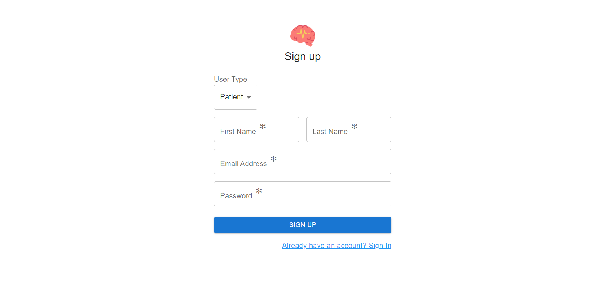

User will have to register using a unique email id and password. The same will be used to login into the system and access the database. User need to select the user type applicable and fill up the signup form. If everything goes well, user will be registered and will be redirected to the signin page.

### Sign in into the system

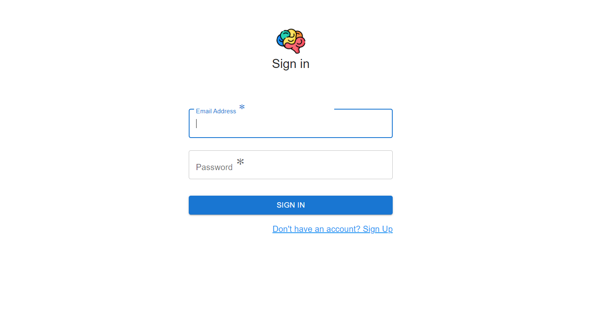

Sign in using the registered email id and password. On successful sign in, user will be redirected to the dashboard based on the user type.

---

</details>

<br>

### Dashboards

<details>
  <summary>Patient Dashboard</summary>
  <br>

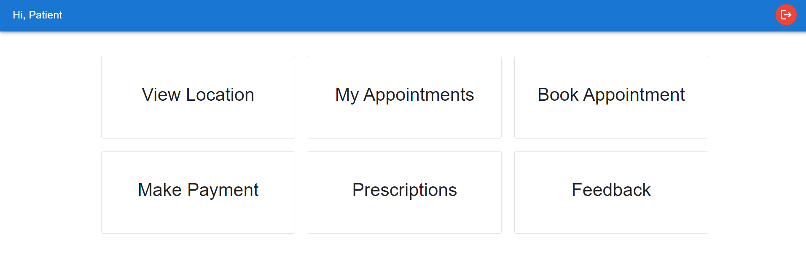

### View Location


Patient can view the location of the clinic on clicking "View Location" tab from their dashboard. An interactive google map will open up with the location of the clinic.

### My Appointments

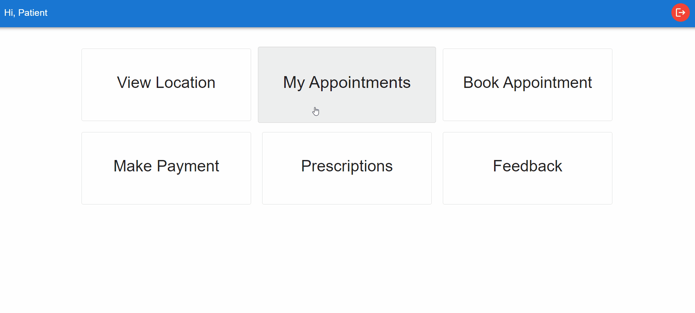
Patient can view their appointments by clicking on "My Appointments" tab. All the confirmed appointments with successful payments will show up. An option to cancel the appointment is also present on the same page.

### Book Appointment

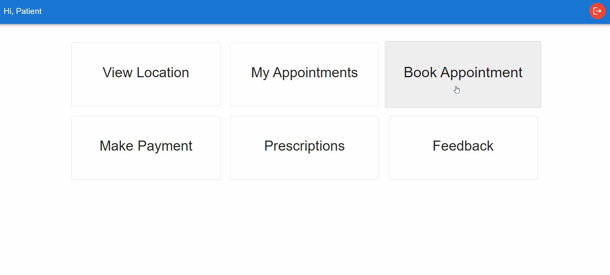
Patient can book an appointment online. List of doctors will show up when clicked on "Book Appointment" tab. Select an appointment date and the list will show up with the doctors available on that particular day. When "BOOK" button is clicked user will be redirected to the payment page. On successful payment, appointment is confirmed and show up under "My Appointments" tab. If payment is not done at the time of booking, patient have the option to either pay by self anytime before the appointment date by clicking on "Make Payment" tab or make offline payment to the reception staff by visiting the clinic.

### Make Payment

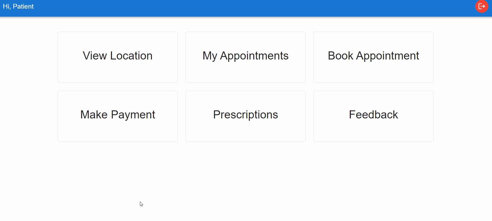
Patient can make payment of any outstanding appointment by clicking on "Make Payment" tab. An appointment is confirmed only on successful payment.

### Prescriptions

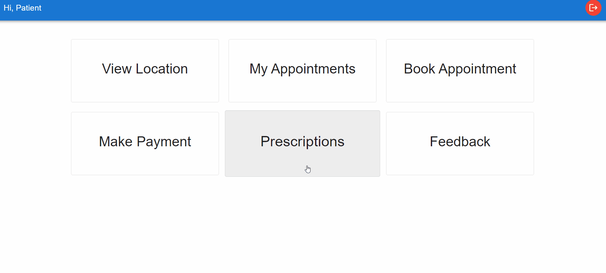
If the patient is prescribed on any appointment by the concerned doctor it will be shown under this tab. The prescription file can be downloaded for any future reference.

### Feedbacks


Patient can write reviews and rate their experience for any of the booked appointments. These feedbacks can be edited, updated and deleted by the patient.

---

</details>

<details>
    <summary>Staff Dashboard</summary>
    <br>

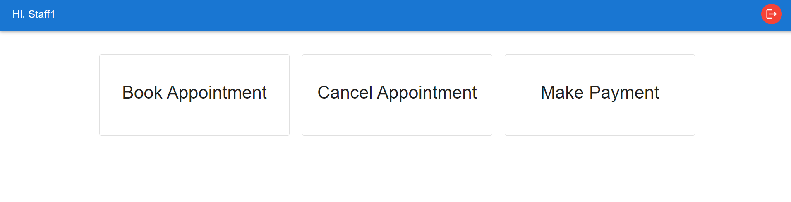

### Book Appointment

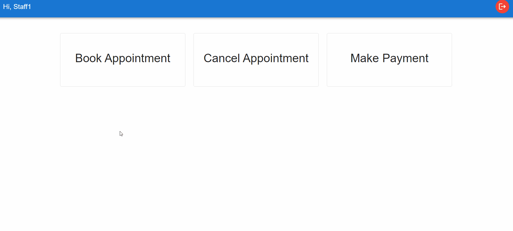
Patient can ask the reception staff to book an appointment on visiting the clinic. The staff in that case will need to enter the email id of the patient which will be used to book the appointment.

### Cancel Appointment


Staff can cancel any appointment by entering the email id of the patient. All the appointments of the patient will show up on submitting the email id. The staff can then cancel any appointment which a patient want the staff to.

### Make Payment

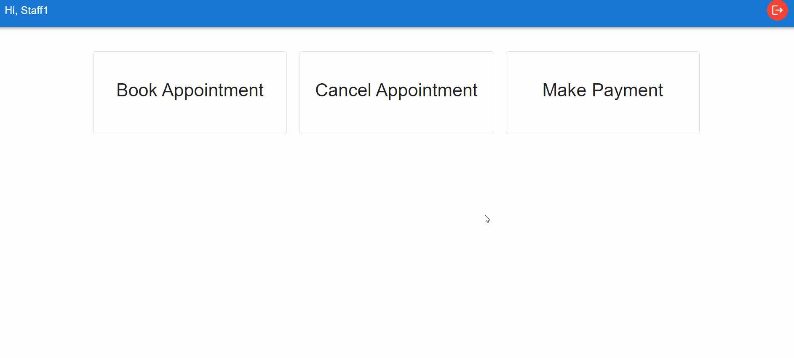
Patient can make offline payment by visiting the clinic. Option of cash payment is also available along with card and upi payments.

---

</details>

<details>
    <summary>Doctor Dashboard</summary>
    <br>

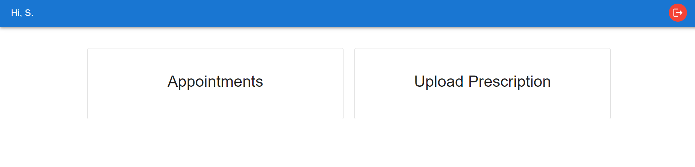

### Appointments

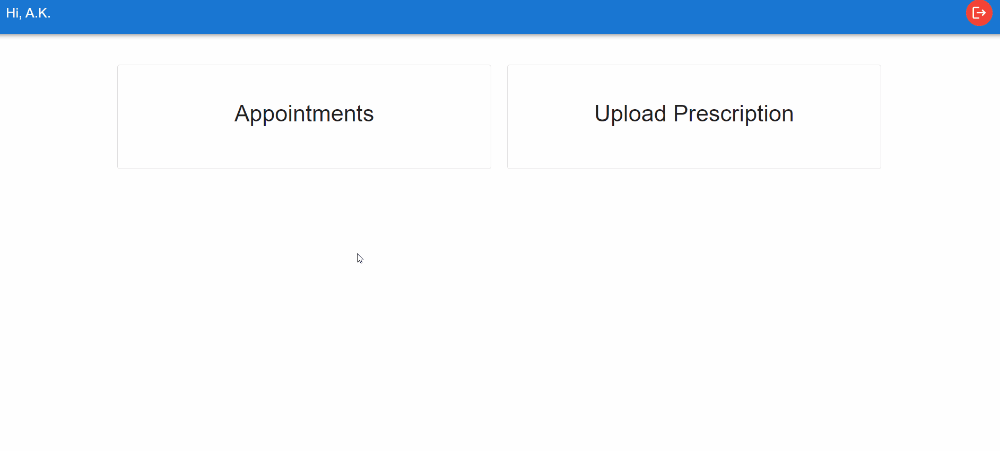
A doctor can access all the appointments under this tab.

### Upload Prescription

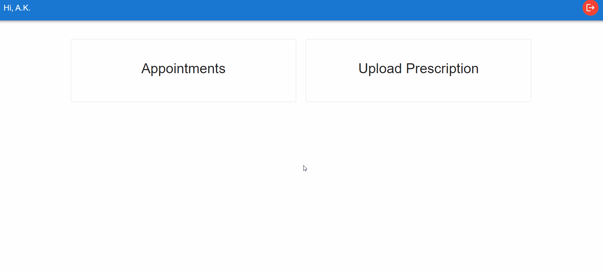
Doctor can upload the prescription for an appointment from here.

---

</details>

<details>
    <summary>Admin Dashboard</summary>
    <br>

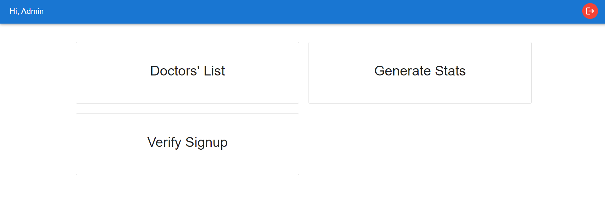

### Doctor List

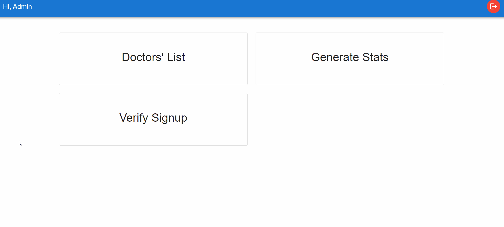
Admin has accesst to complete list of the doctors present in the clinic. Admin can add new doctors to the list and update their fees on this tab.

### Generate Stats


Various stats of the clinic can be generated under this tab. These stats include number of patients registered, number of verified staffs and doctors, most rated doctors, etc. All the patients' feedbacks are also visible inside this tab.

### Verify Signup


Admin can verify or reject the accounts of the staffs and doctors. Staffs or doctors can only login into the system if they are verified by the admin.

</details>

<br>

---

### Run This App Locally

```
yarn && yarn start
```

<br>

> The live app can be accessed on <https://mhc-pms.netlify.app>

<br>
<br>

### Frontend Powered By

[](https://github.com/facebook/create-react-app)

[](https://mui.com/)
